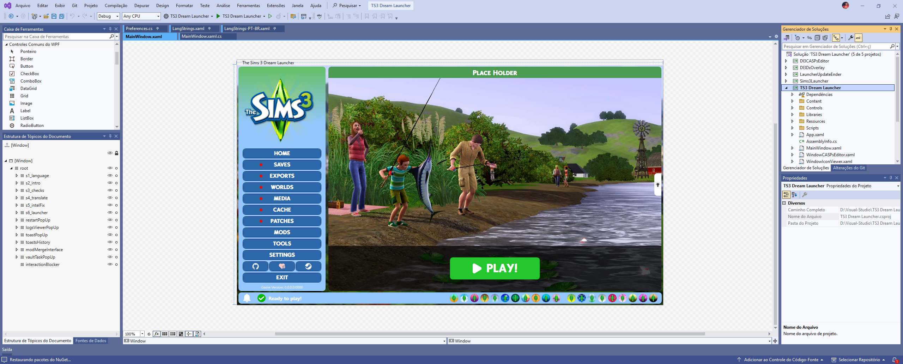
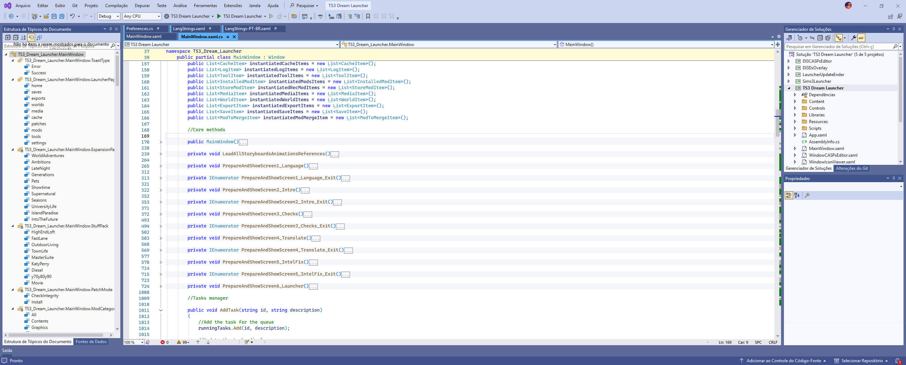

# IDE Preferences
In this repository, you will find the Preferences, Layouts, Settings files, exported from my favorite IDEs, used by me. It is a way to maintain versioning and "backup" of this informations.

# Layouts

Layouts in screenshots.

### Visual Studio Code

### Visual Studio 2022

### Unity

### Android Studio

